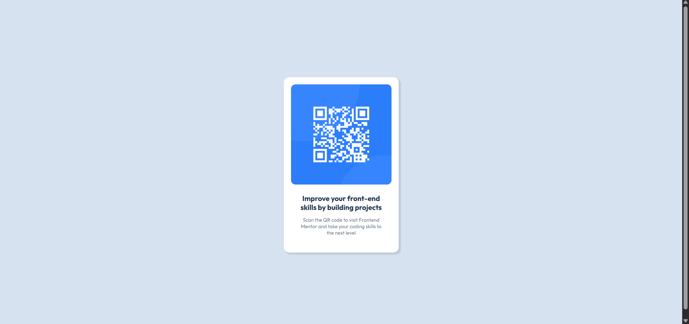

# Frontend Mentor - QR code component solution

This is a solution to the [QR code component challenge on Frontend Mentor](https://www.frontendmentor.io/challenges/qr-code-component-iux_sIO_H). Frontend Mentor challenges help you improve your coding skills by building realistic projects. 

## Table of contents

- [Overview](#overview)
  - [Screenshot](#screenshot)
  - [Links](#links)
- [My process](#my-process)
  - [Built with](#built-with)
  - [What I learned](#what-i-learned)
  - [Continued development](#continued-development)
  
- [Author](#author)

## Overview
This is my first project with Frontend Mentor, its a basic static website using html and css. This QR code component is built mainly focusing on styling of a website. 

### Screenshot

### Links

- Live Site URL: [LIVE SITE](https://nekovox1.github.io/QR-code-component/)

## My process

I started building the component with only html initially, and when everything was put there roughly I started styling it with css. 
For it I first put all the measures using pixels and later change them with rem unit (since they are better for responsiveness). 
And to align the component vertically and horizontally in center, I started of with margins however they are not really good for responsiveness so I switched with flexbox. It worked! 

### Built with

- Semantic HTML5 markup
- CSS custom properties
- Flexbox

### What I learned

With building this component I improved my styling skills, and to make websites responsive smartly.

### Continued development

I want to learn more about web design and how I can make websites look good and responsive.

## Author
- Frontend Mentor - [@nekovox1](https://www.frontendmentor.io/profile/nekovox1)

